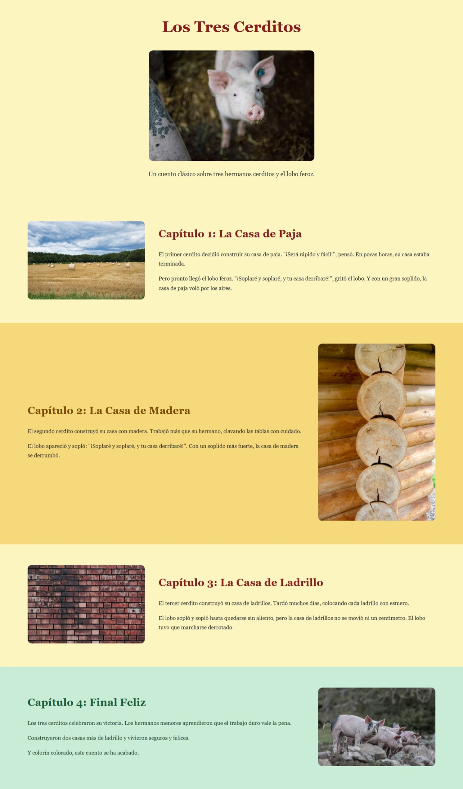

# Los Tres Cerditos 🐷

## Descripción
Página web que cuenta el cuento clásico de Los Tres Cerditos mediante HTML y CSS, con capítulos claramente diferenciados y una imagen representativa por sección.

---

## Prototipo
Antes de programar, diseñé el prototipo visual en Figma para planificar el diseño y la estructura de cada sección:

[Ver boceto en Figma](https://www.figma.com/make/I3hy5eHVt5tsbMmW4KUeC4/Los-Tres-Cerditos-Web-Page?p=f&t=pW1rs2hzbAW0qGky-0)

---

## Planificación

### Estructura de capítulos
Analicé el cuento y lo dividí en 5 secciones clave:

- **Portada**: título, imagen de un cerdito y subtítulo introductorio. Fondo amarillo pálido.
- **Capítulo 1 – Casa de Paja**: imagen de campo de heno a la izquierda, texto a la derecha. Fondo amarillo pálido.
- **Capítulo 2 – Casa de Madera**: texto a la izquierda, imagen de troncos a la derecha. Fondo amarillo dorado.
- **Capítulo 3 – Casa de Ladrillo**: imagen de ladrillos a la izquierda, texto a la derecha. Fondo amarillo pálido.
- **Capítulo 4 – Final Feliz**: texto a la izquierda, imagen de cerditos a la derecha. Fondo verde menta.

### Estructura de carpetas
```
proyecto/
├── index.html
├── .gitignore
├── css/
│   └── style.css
├── images/
│   ├── portada.jpg
│   ├── paja.jpg
│   ├── madera.jpg
│   ├── ladrillo.jpg
│   ├── final.jpg
│   └── screenshot.jpg
└── README.md

```

---

## Planificación de Commits

Antes de escribir código, planifiqué los commits que iba a realizar, ordenados por lógica de construcción. Cada commit resuelve una única tarea.

### 📋 Tabla de commits planificados

| # | Rama | Commit | Qué hace y por qué |
|---|------|--------|-------------------|
| 1 | `docs/planificacion` | `docs: add project planning and commit plan to README` | Documenta la planificación antes de empezar a programar |
| 2 | `feature/estructura-html` | `feat: add HTML structure for all chapters` | Crea el esqueleto HTML con las 5 secciones del cuento |
| 3 | `feature/estructura-carpetas` | `feat: organize project into css and images folders` | Organiza el proyecto en carpetas para separar responsabilidades |
| 4 | `style/base` | `style: add CSS reset and base body styles` | Reset de márgenes y estilos globales del body |
| 5 | `style/portada` | `style: add cover section styles` | Estilos de la portada: layout centrado, imagen y título |
| 6 | `style/capitulo-paja` | `style: add chapter 1 straw house styles` | Estilos de la sección paja: layout flex, fondo y color de título |
| 7 | `style/capitulo-madera` | `style: add chapter 2 wood house styles` | Estilos de la sección madera: fondo dorado y color de título |
| 8 | `style/capitulo-ladrillo` | `style: add chapter 3 brick house styles` | Estilos de la sección ladrillo: fondo y color de título |
| 9 | `style/capitulo-final` | `style: add chapter 4 final scene styles` | Estilos del final: fondo verde menta y colores del texto |
| 10 | `feat/imagenes` | `feat: add images for all sections` | Añade las fotos reales a la carpeta images/ |
| 11 | `docs/readme-final` | `docs: update README with final screenshot and deploy link` | Añade captura del resultado final y enlace a GitHub Pages |
| 12 | feat/gitignore | feat: add gitignore file | Añade el archivo .gitignore para ignorar archivos del sistema |
| 13 | feat/footer | feat: add footer HTML structure | Añade el footer con el nombre del autor y el año |
| 14 | style/footer | style: add footer styles | Añade los estilos del footer |


### 🔀 Flujo de ramas

main
 └── dev
      ├── docs/planificacion
      ├── feature/estructura-html
      ├── feature/estructura-carpetas
      ├── style/base
      ├── style/portada
      ├── style/capitulo-paja
      ├── style/capitulo-madera
      ├── style/capitulo-ladrillo
      ├── style/capitulo-final
      ├── feat/imagenes
      ├── docs/readme-final
      ├── feat/gitignore
      ├── feat/footer
      └── style/footer

Cada rama se mergea a `dev` cuando está completa. Al final, `dev` se mergea a `main` para el despliegue.

---

## Despliegue
[Ver página en GitHub Pages](https://andreavago.github.io/ex-git-three-little-pigs/)

## Captura del resultado final



# Exercise - Git and GitHub - Little Red Riding Hood

## Descripción

El objetivo de este ejercicio es practicar **cuándo y por qué** se realizan los commits, aplicando buenas prácticas de control de versiones. Deberás contar una historia clásica mediante código, prestando especial atención al historial (Git Graph) de tu repositorio.

## Instrucciones

1. Crea un repositorio en GitHub llamado `ex-git-little-red-riding-hood` (o `ex-git-three-little-pigs` si prefieres esa historia. También puedes elegir otro cuento según tu preferencia).
2. **Planificación**: Utiliza Stitch (o herramienta similar) para prototipar tu historia. Antes de programar, analiza y planifica qué commits vas a realizar. Explica en el Readme tu analizis y tu planificación.
3. **Desarrollo**:
   - Cuenta la historia de Caperucita Roja mediante **HTML**. (División clara entre momento claves o capítulos)
   - Añade estilos y diseño con **CSS**.
   - Enriquece la historia con imágenes.
4. **Control de Versiones**: Realiza los commits pertinentes y súbelos al repositorio. **Importante**: El *cuándo* se hace el commit es clave.
5. **Despliegue**: Activa **GitHub Pages** para visualizar el resultado.

## Buenas Prácticas para Commits

Para superar este ejercicio con éxito, aplica estas reglas en tu flujo de trabajo:

- **Atomicidad**: Cada commit debe resolver una única tarea lógica (ej: "Crear estructura HTML básica", "Añadir estilos al header"). No mezcles cambios de diferentes contextos en un solo commit.
- **Mensajes Descriptivos**: El mensaje debe explicar *qué* hace el commit y el *por qué* de los cambios, en lugar del *cómo*. Usa imperativo (ej: `feat: add navigation bar` o `style: change background color`).
- **Frecuencia**: Haz commit a menudo. No esperes a terminar todo el proyecto. Si algo funciona, haz commit.
- **Convenciones**: Usar *Conventional Commits* (prefijos como `feat:`, `fix:`, `docs:`, `style:`) para mantener el historial ordenado. [Conventional Commits](https://www.conventionalcommits.org/en/v1.0.0/#summary)

## Requisitos Técnicos

- Uso de HTML5 y CSS3.
- Despliegue funcional en GitHub Pages.

## Entregables

- Enlace al repositorio de GitHub.
- Enlace a la página desplegada en GitHub Pages.
- Una captura de pantalla del resultado final (visible en el `README.md` del repositorio).

---


|   Nivel                            | Descripción del desempeño                                                                                      | Puntuación |
|------------------------------------|----------------------------------------------------------------------------------------------------------------|------------|
| Ejercicio no entregado | No se entrega repositorio, no hay código, o no existe ninguna contribución real en el historial de commits.                |	0 pts      |
| Ejercicio no cumple con un mínimo. | El repositorio existe pero no cumple los requisitos mínimos: historia incompleta, HTML o CSS insuficientes, commits escasos o mal estructurados, README pobre o inexistente, sin despliegue en GitHub Pages. | 40 pts |
| Ejercicio cumple con un mínimo pero falla en ciertos aspectos | La historia está contada en HTML, hay estilos CSS básicos, imágenes añadidas, commits realizados con cierta lógica, README funcional, y GitHub Pages activado. Sin embargo, faltan buenas prácticas claras, planificación insuficiente o commits poco atómicos. | 70 pts |
| Ejercicio  completo y con todos los requisitos implementados | Historia completa en HTML con capítulos claros, CSS trabajado, imágenes integradas, planificación explicada en el README, commits atómicos y bien descritos siguiendo Conventional Commits, historial limpio, despliegue en GitHub Pages funcional, y README bien redactado con captura final. | 100 pts |
